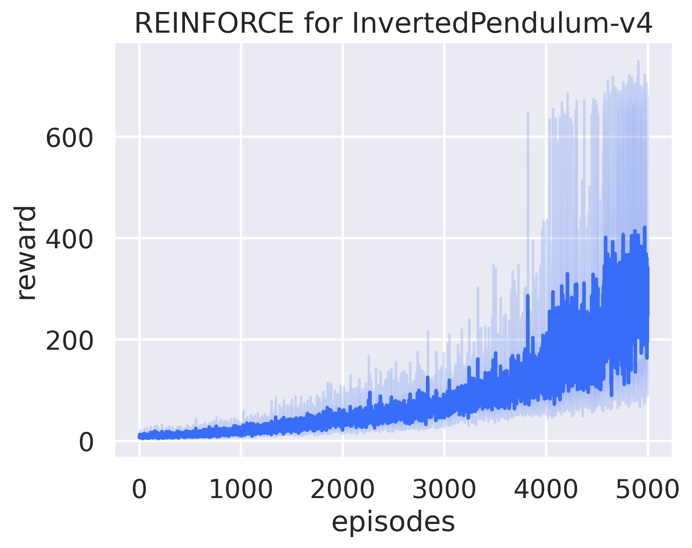

# Reinforce Learning for MuJoCo inverted pendulum

This repository contains a PyTorch implementation of the REINFORCE algorithm to solve the `InvertedPendulum-v5` environment from the [Gymnasium](https://gymnasium.farama.org/) library. The agent is trained to balance a pendulum upright on a cart, a classic control problem.

The implementation is based on the official Gymnasium tutorial for the REINFORCE algorithm, which can be found [here](https://gymnasium.farama.org/v0.27.0/tutorials/reinforce_invpend_gym_v26/).

## Learning Curve

The training script runs the experiment over multiple seeds and plots the average reward per episode. The resulting learning curve demonstrates the agent's performance improvement over time.



Below is a demonstration of the trained agent balancing the pendulum.


## Getting Started

### Prerequisites

- [UV](https://docs.astral.sh/uv/getting-started/installation/) for dependency management

### Installation

1.  **Clone the repository:**

    ```bash
    git clone https://github.com/vnniciusg/rl-mujoco-inverted-pendulum.git
    cd rl-mujoco-inverted-pendulum
    ```

2.  **Install dependencies:**

    ```bash
    uv sync
    ```

### Usage

To train the REINFORCE agent, run the main training script:

```bash
uv run train.py
```

The script will:

- Train the agent for 5000 episodes using multiple random seeds.
- Log the training progress to the console.
- Save videos of the agent's performance at regular intervals in directories named `inverted-pendulum-seed-*`.
- Generate a `reinforce_learning_curve.png` plot showing the rewards over episodes.

## Project Structure

```
    .
    ├── LICENSE
    ├── pyproject.toml
    ├── README.md
    ├── train.py                # Main script to train the agent
    ├── src
    │   ├── environment.py      # Sets up the Gymnasium environment
    │   ├── police_network.py   # Defines the policy neural network
    │   └── reinforce.py        # Implements the REINFORCE algorithm
    └── inverted-pendulum-seed-* # Directories for saved videos
```

- **`train.py`**: The main entry point for training. It orchestrates the environment, the agent, and the training loop, and plots the results.
- **`src/reinforce.py`**: Contains the `REINFORCE` agent class, which implements the core logic of the algorithm, including action sampling and policy updates.
- **`src/police_network.py`**: Defines the `PolicyNetwork` class, a simple neural network that parameterizes the policy.
- **`src/environment.py`**: A utility module to create and wrap the `InvertedPendulum-v5` environment, including wrappers for video recording and statistics.

## License

This project is licensed under the MIT License. See the [LICENSE](LICENSE) file for details.
